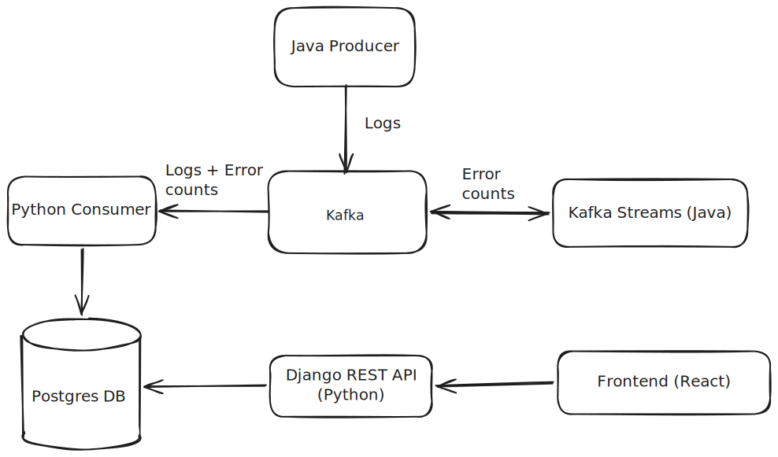

# Random Kafka Logging System
> A system that creates random logs in Java, adds these to a topic that is then consumed by Python and added to a Postgres database that can be interacted with through a Django REST API.

## System
### Demo

### System Design
